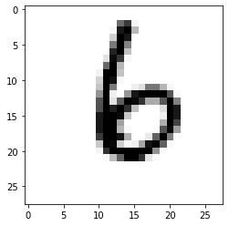
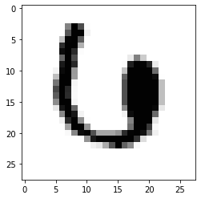
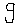
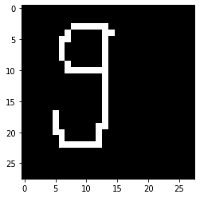

# Convolutional Neural Network 
## Build the MNIST model using Tensorflow, Keras & Python


```python
import tensorflow as tf
import matplotlib.pyplot as plt
import numpy as np
```


```python
#Tuple of Numpy array = mnist dataset
(x_train, y_train),(x_test, y_test) = tf.keras.datasets.mnist.load_data() 
```


```python
#draw static images in the notebook
%matplotlib inline
```


```python
#choose random index to display the data
image_index = 2020 
```


```python
#the label (y) of the picture at index 2020 of the train dataset is 6
print(y_train[image_index]) 
```

    6
    


```python
#plot image (x) corrresponding to the label 6 at index 2020
plt.imshow(x_train[image_index], cmap='Greys')
```


    <matplotlib.image.AxesImage at 0x29e8ba82dc8>





```python
#Shape of the dataset (need to channel it to the CNN)
x_train.shape
#60000 number of images in x_train, 28x28 pixels per images
#3-dimensions dataset : (n, width, height)
```


    (60000, 28, 28)


```python
#RESHAPING AND NORMALIZING THE DATA
# Reshaping the array to 4-dims: (n, depth, width, height) 
# Depth = 1 (because Grey / depth = 3 if RGB)
x_train = x_train.reshape(x_train.shape[0],28,28,1)
x_test = x_test.reshape(x_test.shape[0],28,28,1)
input_shape = (28,28,1)
```


```python
print(x_train.shape) #4-dims
print(x_test.shape)  #4-dims
```

    (60000, 28, 28, 1)
    (10000, 28, 28, 1)
    


```python
#Making value float32 to get decimal points after division
x_train = x_train.astype('float32')
x_test = x_test.astype('float32')
x_test.dtype
```


    dtype('float32')


```python
#Normalize the data to the range [0,1] (always required in neural network models)
x_train /= 255.0
x_test /= 255.0
```


```python
#BUILDING THE CONVOLUTIONAL NEURAL NETWORK
```


```python
# Importing the required Keras modules containing model and layers
from tensorflow.keras.models import Sequential #create models layer-by-layer. Doesn't create models that share layers or have multiple inputs or outputs
from tensorflow.keras.layers import Dense, Conv2D, Dropout, Flatten, MaxPooling2D
```


```python
# Creating a Sequential Model
model = Sequential()

#Adding the layers

#Conv2D (multiplication and summation of matrix)
#A convolution is an operation that changes a function into something else.
#Used to extract simple features by passing a small matrix (called kernel or filter) on our image
model.add(Conv2D(filters = 28, kernel_size=(3,3),input_shape=input_shape)) #input_shape = (width, height) 

#Pooling layer : to progressively reduce the spatial size of the representation 
#to reduce the amount of parameters and computation in the network

#MaxPooling2D layer (the most common approach): 
#Select a maximum value from each region and put it in the corresponding place in the output
model.add(MaxPooling2D(pool_size=(2,2)))

#Flatten
#Collapses the spatial dimensions of the input into the channel dimension
model.add(Flatten()) #Flattening the 2D arrays for fully connected layers

#Dense layer - Relu
#A dense layer is a classic fully connected neural network layer : each input node is connected to each output node.
#Relu non-linear function gives an output x if x is positive and 0 otherwise.
model.add(Dense(128, activation=tf.nn.relu))

#Drop-out function (avoid overfitting)
#WHY ?
model.add(Dropout(0.2))

#Dense Layer - Softmax
model.add(Dense(10,activation=tf.nn.softmax))
```


```python
#COMPILING AND FITTING THE MODEL
#set an optimizer with a given loss function
model.compile(optimizer='adam', loss='sparse_categorical_crossentropy',metrics=['accuracy'])
```


```python
#Fit the model
model.fit(x=x_train,y=y_train, batch_size = 32, epochs=7, verbose=1)
```

    Train on 60000 samples
    Epoch 1/10
    60000/60000 [==============================] - 191s 3ms/sample - loss: 0.2037 - accuracy: 0.9389
    Epoch 2/10
    60000/60000 [==============================] - 195s 3ms/sample - loss: 0.0878 - accuracy: 0.9722
    Epoch 3/10
    60000/60000 [==============================] - 196s 3ms/sample - loss: 0.0627 - accuracy: 0.9801
    Epoch 4/10
    60000/60000 [==============================] - 190s 3ms/sample - loss: 0.0471 - accuracy: 0.9847
    Epoch 5/10
    60000/60000 [==============================] - 190s 3ms/sample - loss: 0.0369 - accuracy: 0.9876
    Epoch 6/10
    60000/60000 [==============================] - 189s 3ms/sample - loss: 0.0318 - accuracy: 0.9891
    Epoch 7/10
    60000/60000 [==============================] - 190s 3ms/sample - loss: 0.0270 - accuracy: 0.9908
    Epoch 8/10
    60000/60000 [==============================] - 190s 3ms/sample - loss: 0.0227 - accuracy: 0.9920
    Epoch 9/10
    60000/60000 [==============================] - 192s 3ms/sample - loss: 0.0192 - accuracy: 0.9933
    Epoch 10/10
    60000/60000 [==============================] - 189s 3ms/sample - loss: 0.0192 - accuracy: 0.9937
    


    <tensorflow.python.keras.callbacks.History at 0x29e8a9e0348>


```python
#EVALUATING THE MODEL
model.evaluate(x_test, y_test)
```


```python
#TEST
image_index = 1444 #8
plt.imshow(x_test[image_index].reshape(28,28),cmap='Greys')
x_test[image_index].shape
```


    (28, 28, 1)





```python
pred = model.predict(x_test[image_index].reshape(1, 28, 28, 1))
```


```python
print(pred.argmax())
```

    6
    


```python
pip install pillow
import PIL
from PIL import Image
```

    Requirement already satisfied: pillow in c:\users\theo\anaconda3\envs\env_mnist\lib\site-packages (7.0.0)
    Note: you may need to restart the kernel to use updated packages.
    


```python
img = Image.open('9.png').convert("L")
img
```





```python
im2arr = np.array(img).astype('float32')
im2arr /= 255.0
```


```python
im2arr = np.array(img).astype('float32')
im2arr /= 255.0
plt.imshow(im2arr, cmap='Greys')
im2arr = im2arr.reshape(1,28,28,1)
im2arr.shape
```


    (1, 28, 28, 1)





```python
pred = model.predict(im2arr.reshape(1, 28, 28, 1))
```


```python
print(pred.argmax())
```

    5
    


```python

```
